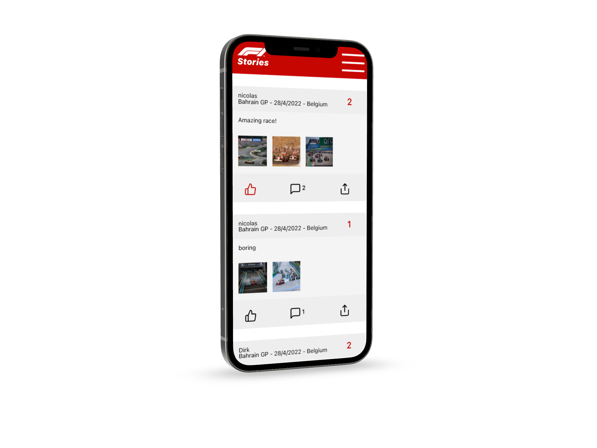

<p align="center">

</p>

# F1 Stories: PWA
PWA that allows users to write about their experiences at Formula One Races.


## Features:
- Create an acccount!
- View and interact with other people's stories!
- Scan race barcodes to add them to your profile!
- Create your own stories!
- and much more

## Description
This PWA is compatible with both backends, the one used in the production environment is the Laravel one.

The app is available at https://f1stories.web.app/  
and the url of the API is https://f1stories.herokuapp.com/api/

  
If you want to run the NodeJS backend, you will have to do the following steps:
- Change the "apiurl" const in the data.js file, in my case it would be http://localhost:3001/api 
- Change "apiurl" and "backendurl" to the backend, in my case these values:
- const apiurl = "http://localhost:3001/api";  
const backendurl = "http://localhost:3001/";
- Log out of the app in settings
- If you want the images to be visible, make sure that the backendurl variable is added to the src tags where posts are loaded in html ```
src="${backendurl}${post.image1}"```
. 
This can be found at line 161 and other lines in the script.js file.

The barcode scanner will scan the code-128 barcode format, the accepted values are the racenames.      
I used <a href="https://barcode.tec-it.com/en/Code128?data=Bahrain%20GP">this</a> generator. If you want to create another race code, grab a title value from <a href="https://f1stories.herokuapp.com/api/races">this</a> endpoint and generate the code.


